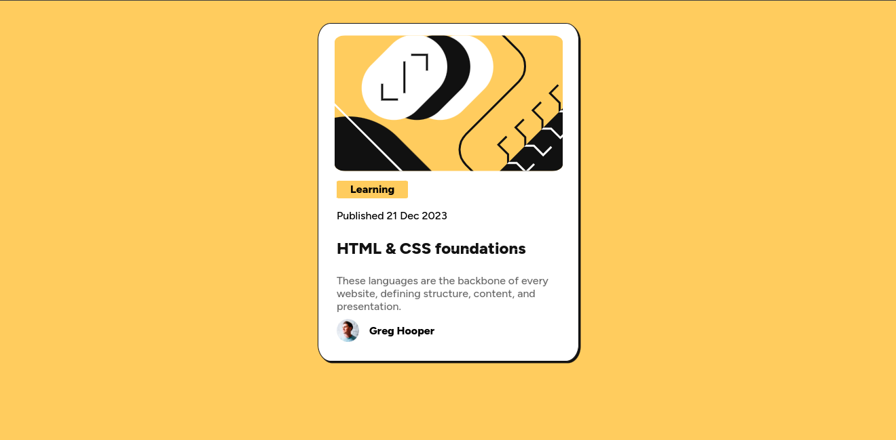
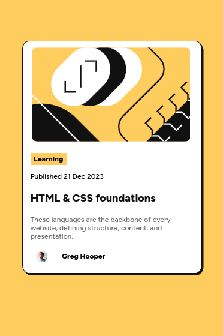

# Frontend Mentor - Blog preview card solution

This is a solution to the [Blog preview card challenge on Frontend Mentor](https://www.frontendmentor.io/challenges/blog-preview-card-ckPaj01IcS). Frontend Mentor challenges help you improve your coding skills by building realistic projects. 

## Table of contents

- [Overview](#overview)
  - [Screenshot](#screenshot)
  - [Links](#links)
- [My process](#my-process)
  - [Built with](#built-with)
  - [Continued development](#continued-development)
- [Author](#author)

**Note: Delete this note and update the table of contents based on what sections you keep.**

## Overview

### Screenshot

#### Desktop screenshot

#### Mobile screenshot

### Links

- Solution URL: [Frontend Mentor solution URL here](https://www.frontendmentor.io/solutions/responsive-blog-preview-card-using-flexbox-and-viewport-margins-xiDfeWGTK6)
- Live Site URL: [Live site URL here](https://blog-preview-card-gamma-drab.vercel.app)

## My process

- Setting CSS file and putting all raw elements on screen
- Using 'body' element to centralize all other elements
- The author section was made with flexbox (the other parts I thought it was unnecessary)
- The responsiveness was an easier part, since I reused older projects

### Built with

- Semantic HTML5 markup
- CSS custom properties
- Flexbox
- CSS media queries
- Mobile-first workflow

### Continued development

Code reuse is quite helpful and helps at reinforcement learning.

## Author

- Website - [Luan Santos Gonçalves](https://www.linkedin.com/in/luangoncas/)
- Frontend Mentor - [@luanGoncas](https://www.frontendmentor.io/profile/luanGoncas)